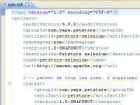

## Date et lieu

-   Mardi 11 mars 2008
-   Dans les locaux de [Port Parallèle](/xwiki/wiki/oldversion/view/Location/PortParallele)

**50 participants**

## Détails

### 19h à 19h15 : Accueil

### 19h15 à 20h30 : Selenium - un outil de tests fonctionnels en
java/J2EE

Selenium est un logiciel libre sous licence Apache 2.0 développé par la
société ThoughtWorks. Il permet pour les applications web de réaliser
des tests fonctionnels qui s'exécutent directement dans un navigateur
que ce soit Internet Explorer, Mozilla, Opéra ou Firefox. Il sert donc
aussi à vérifier la compatibilité d'une application vis à vis de ces
navigateurs.

Cet outil fournit des composants autorisant différentes configurations
de tests. Les deux options les plus séduisantes sont : un IDE sous la
forme d'un module firefox qui permet l'enregistrement et la réexécution
d'une interaction entre un utilisateur et une application web; un
composant permettant de simuler des tests directement en langage java et
autorisant donc leur automatisation.

Au cours de cette session, Zouheir CADI nous présentera Selenium et
décrira ses principaux composants. Une attention particulière sera
accordée aux possibilités attrayantes qu'offre cet outil en
environnement java. La session sera illustrée par une démonstration
basée sur un cas réel.

-   **Intervenant** : [Zouheir Cadi]()

### 20h30 à 20h45 : Questions / Réponses

### 20h45 : Buffet

## Sponsors de l'évènement

## Post (blog) sur la présentation

- [Réunion du Paris JUG sur Selenium](http://blog.developpez.com/java?title=reunion_du_paris_jug_sur_selenium)
    *(developpez.com)*

## Télécharger la présentation

[Télécharger au format
pdf](Selenium%2DZouheirCADI.pdf)

[Télécharger fichier demo](pom.xml)

## Feedback



[Visionner l'album complet de la soirée](https://www.flickr.com/photos/23839812@N08/sets/72157604802040819/with/2452176797/)
